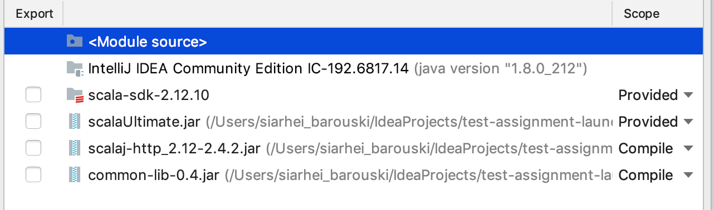
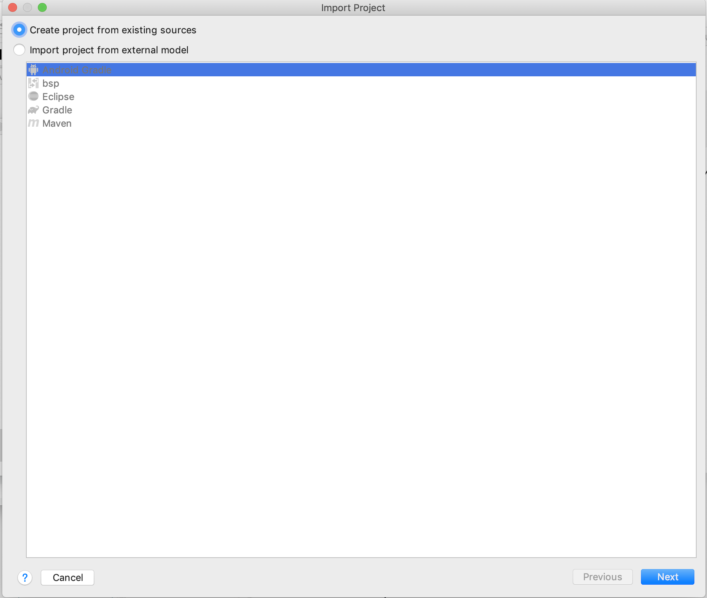

### Test Assignment Plugin for IntelliJ IDEA

Glad to introduce you the first of its kind(sarcasm) plugin to perform test assignments.


### Project Structure


### Quick Start
1. Check IntelliJ IDEA Version(IntelliJ IDEA -> About IntelliJ IDEA).
Plugin works only with the version 192.0 or higher.

2. Make sure you have Scala plugin installed.

3. Make sure you have Docker installed.

4. Install plugin from hard disk.<br>
File path - ./IdeaPlugin/IdeaPlugin.zip

5. Set the local dependency.<br>
Command - ```cd ./Server/common-lib/; sbt compile assembly publishLocal```.

6. Build all the containers you may need for testing.<br>
The command will have approximately the following appearance - ```cd ./Server/testAssignmentChecker/*; sbt compile assembly docker```.<br>
Except for the assignmentCheckerTemplate.g8 folder, this is the Giter8 template.

7. Start web server.<br>
   Command - ```cd ./Server/web-server; sbt compile run```<br>
   Requires two global variables:
   1. DOCKER_HOST=unix:///var/run/docker.sock(Windows - https://stackoverflow.com/questions/39487399/docker-host-environment-variable-on-windows)
   2. ASSIGNMENT_DIRECTORY_PATH=Path to folder(Choose any folder, we'll store the results there)

8. Explore the graphical part of the plugin. [Go](#graphical-part)


### Idea Plugin


### Features

You may encounter some peculiarities during development.<br>

JetBrains has a rather specific system of loading plugins and if you have overlaps in dependencies, you'll fall with errors at the class loader level.<br>
 
This is the main reason why Scala-library should be set as a provided dependency because it will be pulled from Scala plugin (version 2.12.4 or so).

This also applies to the common-lib, I built a custom version without Scala-library special for IdeaPlugin.<br>

All dependencies from the lib folder must be connected as compile(Except for ScalaUltimate.jar, this is Scala Plugin).<br>

Since there's no sbt there, we'll have to do it manually.




### Project Import

Since it is a plugin, it has a fairly specific import process(Actually, it's all simple, there's an iml file at the root).

Steps:
1. 

2. 

3. 

4. 

5. 

6. 

7. 

8. 

9. 
Unfortunately, you cannot use java version higher than 1.8.<br>
You'll also need a IntelliJ Plugin SDK, not a regular jdk.


### Process of adding a stub

1. Add a stub to the following folder - ./IdeaPlugin/resources/test-assignment-stubs (This is the stub that the user will import, in most cases it is just a base project with a jar file and task description).

2. Describe your stub project in the IdeaPlugin project(Do it in the AssignmentNamingHelper object, add an additional AssignmentDescription).

3. Create an implementation of your controller.<br>
 To do this, use the giter8 template and define the necessary checks(This can be a set of tests or a memory check, you are free to do what you want).<br>
 The project must be located in the ./Server/testAssignmentChecker folder and can be built with the following command - ```sbt docker```.
 
4. Add mapping on the web server side(This can be done in the DockerAssignmentsInitialization trait).

### Graphical part

1. Import project - Allows you to import one of the stubs.

2. Project Reinitialization - Returns the project to its original form.

3. Submit Project - Allows you to send the project for verification.

4. Show Result - Demonstrates test results.
